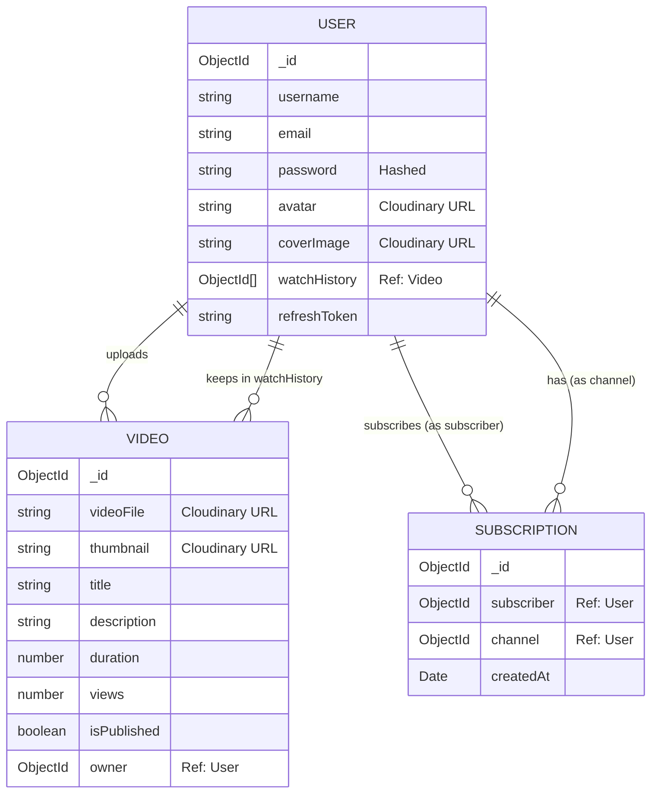

# VideoTube Backend Project Documentation

## 1. Project Overview
**VideoTube** is a backend for a video hosting platform similar to YouTube. It provides a robust RESTful API for features like user registration, authentication, video management, subscription systems, and watch history tracking.

### Core Philosophy
The project follows a production-grade structure focusing on scalability, maintainability, and clean code practices. It uses the **MVC (Model-View-Controller)** pattern (server-side controllers) to separate concerns.

---

## 2. Technology Stack & Key Decisions

| Technology | Purpose | Reason for Choice |
| :--- | :--- | :--- |
| **Node.js** | Runtime Environment | Non-blocking I/O is ideal for data-heavy streaming applications. |
| **Express.js** | Web Framework | Minimalist, flexible, and robust routing middleware ecosystem. |
| **MongoDB (Mongoose)** | Database | Flexible schema design is perfect for content management (videos, comments) where structure might evolve. |
| **Cloudinary** | Media Storage | Offloads complex video/image processing and delivery (CDN) from the main server. |
| **JWT (JSON Web Tokens)** | Authentication | Stateless authentication allows the backend to scale horizontally without server-side sessions. |
| **Bcrypt** | Security | Industry-standard password hashing to ensure user security. |
| **Multer** | File Uploads | Handles `multipart/form-data` efficiently for uploading video and image files locally before sending to Cloudinary. |

---

## 3. High-Level Architecture (Big Picture)

The application is built around the interaction between **Users**, **Videos**, and **Subscriptions**.

### Data Model Overview (Mermaid Diagram)



### Model Relationships Explained
1.  **User ↔ Video**: A one-to-many relationship. A user can upload multiple videos.
2.  **User ↔ Watch History**: A user has an array of references to videos they have watched. This allows for quick personalized recommendations.
3.  **Subscription (The Pivot Table)**: instead of a simple array on the User model, a separate **Subscription** model is used.
    *   **Why?** If a user has 1 million subscribers, storing 1 million IDs in a single `User` document array would hit MongoDB's document size limit (16MB).
    *   **Solution**: The `Subscription` model acts as a join table. Each document represents *one* follow action containing just the `subscriber_id` and `channel_id`. Counting subscribers is then just a count query on this collection.

---

## 4. Key Implementation Details

### A. Authentication & Security
*   **Dual Tokens (Access & Refresh)**:
    *   **Access Token (Short-lived)**: Valid for a short time (e.g., 1 day). specific for authorizing API requests.
    *   **Refresh Token (Long-lived)**: Stored in the database. Used to generate a new access token without requiring the user to log in again. This allows you to revoke access by simply removing the refresh token from the DB.
*   **Password Hashing**: Uses `mongoose` pre-save hooks to automatically hash passwords before they are saved to the DB. This ensures plain text passwords are never stored.

### B. File Handling Wrapper
*   **Strategy**: Files are uploaded in two stages to prevent server overload.
    1.  **Multer**: Temporarily saves the file to the local server's `./public/temp` folder.
    2.  **Cloudinary Utility**: A wrapper function `uploadOnCloudinary` takes the local file path, uploads it to Cloudinary, and then *deletes* the local file (`fs.unlinkSync`).
    *   **Reason**: If Cloudinary upload fails, we don't want to lose the file immediately, or if the server crashes, we don't want to hold onto temp files forever. The wrapper manages this cleanup.

### C. Standardized API Responses
*   **`ApiError` Class**: Extends the native `Error` class to standardize error structure (statusCode, message, success=false).
*   **`ApiResponse` Class**: Wraps all successful responses (statusCode, data, message, success=true).
*   **`asyncHandler` Wrapper**: A higher-order function that wraps all controllers. It automatically catches asynchronous errors and passes them to the global error handling middleware, removing the need for `try-catch` blocks in every single controller method.

### D. Complex Aggregations
The project uses MongoDB Aggregation Pipelines for complex data retrieval.
*   **Example: `getUserChannelProfile`**:
    *   It doesn't just `find` a user.
    *   It `lookup`s (joins) the `subscriptions` collection twice:
        1.  To count how many people subscribe to this user.
        2.  To count how many people this user subscribes to.
    *   It also checks `isSubscribed` by comparing the current user's ID against the subscriber list.
    *   **Why?** Doing this in a single DB query is much more performant than making 3-4 separate queries from the logic layer.

---

## 5. Folder Structure Explained

```
src/
├── app.js            # Express app configuration, middleware setup (cors, cookie-parser)
├── index.js          # Entry point, database connection execution, server start
├── constants.js      # Global constants (DB_NAME)
├── db/
│   └── index.js      # Database connection logic
├── models/           # Mongoose schemas (User, Video, Subscription)
├── controllers/      # Business logic (RequestHandler functions)
├── routes/           # API route definitions
├── middlewares/      # Interceptors (Multer, Auth verification)
└── utils/            # Helper classes/functions (ApiError, Cloudinary, asyncHandler)
```
